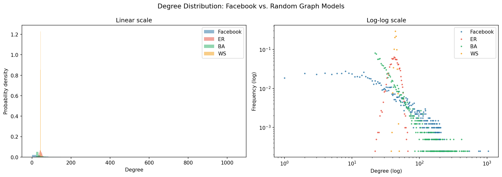
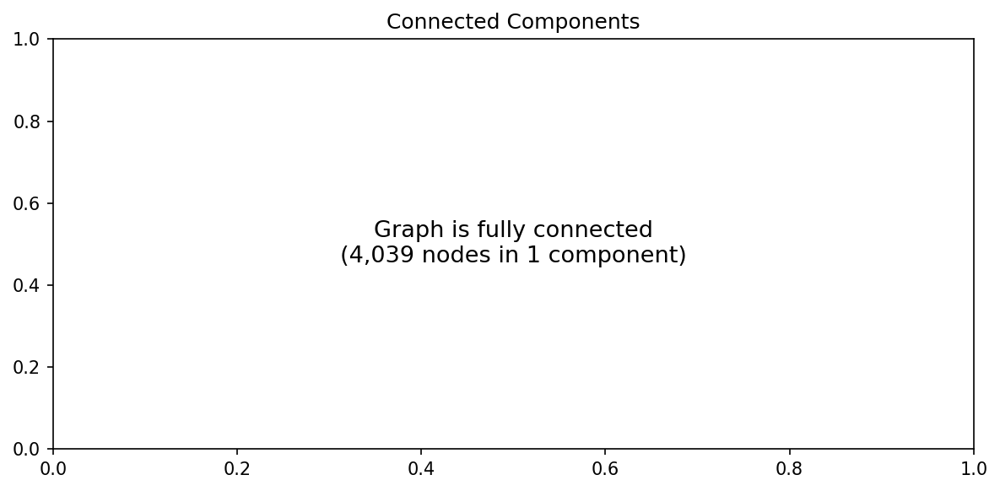
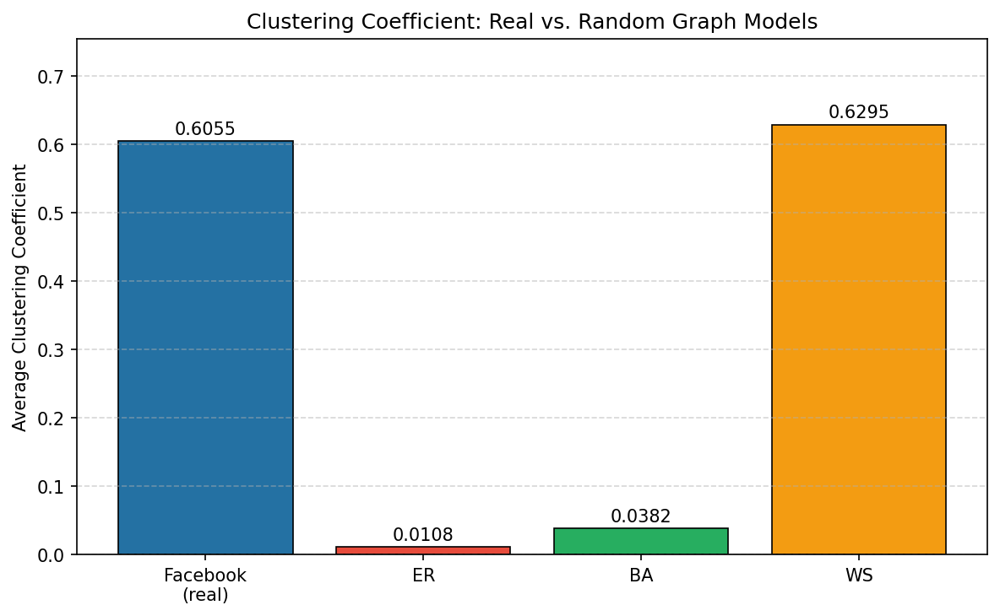
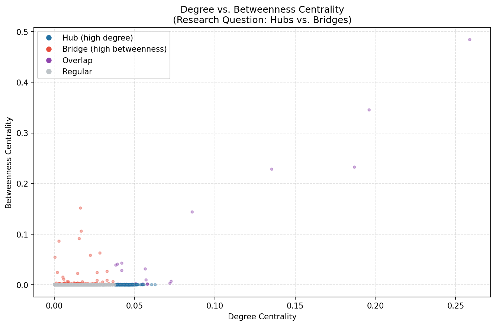

# b107-sna-facebook
B107 Social Network Analysis — Facebook Ego Network
# B107 — Social Network Analysis of the Facebook Ego Network

**Gisma University of Applied Sciences | Winter 2026**

## Dataset
- **Source:** [SNAP Facebook Ego Network](https://snap.stanford.edu/data/ego-Facebook.html)
- **Nodes:** 4,039 | **Edges:** 88,234
- **Type:** Undirected, unweighted

## How to Run
1. Install dependencies:
   pip install networkx matplotlib numpy pandas scipy
2. Run the pipeline:
   python analysis.py

All plots will be saved to the `plots/` directory.

## Results

### Degree Distribution

### Connected Components

### Clustering Comparison

### Hub vs Bridge Scatter (Research Question)

## Key Statistics
| Metric | Value |
|--------|-------|
| Avg Degree | 43.69 |
| Avg Clustering | 0.6055 |
| Avg Path Length | 3.578 |
| Diameter | 7 |
| Components | 1 |
